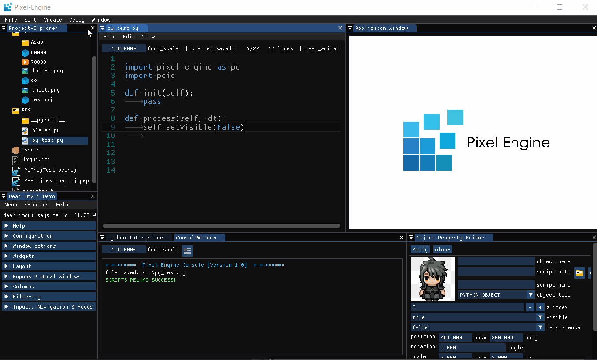

# Pixel-Engine

 
 

 

Pixel engine is a simple interactive application and game engine written in C++ and Python. Currently in early stage and only supports for windows x64. Since the engine supports python scripting it can also be used as a learning tool for python.

## Demo

